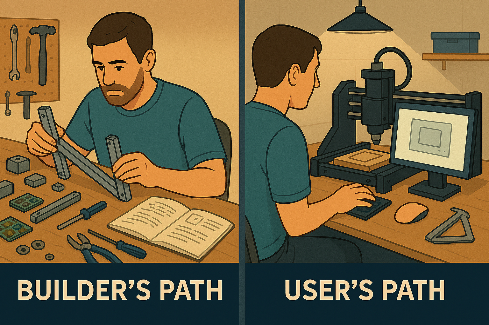

## Introduction

The digital manufacturing community loves to debate the merits of building versus buying your first machine. Walk into any makerspace or browse online forums, and you'll inevitably encounter the passionate advocate declaring: "You need to build your own first machine to truly understand it!" While this approach works wonderfully for some makers, it's far from universal advice. Your learning style, available time, and goals should drive this decision, not dogma.

## The Case for Starting with Something That Works

When I reflect on my journey through various digital manufacturing technologies, I consistently found success by starting with machines that worked reliably out of the box. This wasn't laziness or impatience—it was a strategic choice that aligned with how I learn best.

Consider the cognitive load involved in learning any new digital manufacturing process. You're simultaneously grappling with:

- Design software and workflow
- Material properties and preparation  
- Toolpath generation and optimization
- Machine operation and safety
- Troubleshooting process failures
- Post-processing techniques

Adding "did I assemble this correctly?" or "is this electrical connection causing my problem?" introduces variables that can derail the entire learning process. When something goes wrong—and it will—you need to isolate whether the issue stems from your design, your process, or your machine's construction.

Starting with a known-good machine eliminates that last category of problems during the crucial early learning phase. You can focus entirely on developing your skills and understanding without the frustration of debugging hardware issues that may be beyond your current expertise.

## Learning Styles and Instant Gratification

Not everyone thrives on delayed gratification. Some makers genuinely enjoy spending months troubleshooting a kit build, viewing each obstacle as a puzzle to solve. Others need early wins to maintain motivation and build confidence. Neither approach is superior—they're simply different learning styles that require different strategies.

For makers who benefit from early success, starting with a working machine provides immediate positive feedback. You can generate your first successful print, cut, or engraving within hours rather than weeks. This early success creates momentum and helps you understand what "good" looks like before you start diagnosing problems.

The chunked learning approach also proves more sustainable for many people. Instead of front-loading all the mechanical, electrical, and operational knowledge simultaneously, you can sequence your learning over time. Master the basics of operation first, then gradually absorb the deeper mechanical understanding as maintenance and upgrades become necessary.

## The Organic Learning Path

Here's the reality that build-first advocates often overlook: machines break, wear out, and need upgrades regardless of who assembled them initially. A purchased machine doesn't insulate you from learning opportunities—it simply spreads them across a more manageable timeline.

My current project perfectly illustrates this organic learning progression. I'm rebuilding a second-hand Ultimate Bee CNC router that I acquired after gaining experience with my Carvera Air. The Bee needed significant work—new wiring, updated limit switches, mechanical refurbishment, and the addition of an Opt Lasers PLH3D-XF+ kit for laser engraving capabilities.

This project gives me all the educational value of a from-scratch build, but with crucial advantages:

- I understand what the finished machine should do because I've operated similar equipment
- I can recognize when something isn't working correctly because I know what "right" looks like  
- I have realistic expectations about capabilities and limitations
- The stakes feel lower because this supplements rather than replaces my primary workflow

The rebuilt Ultimate Bee will eventually replace my XTool M1 laser engraver while complementing my existing CNC mill. This represents a natural progression: starting with reliable tools, gaining experience, then taking on more complex projects as knowledge and confidence grow.

## Building Knowledge, Not Just Machines

The goal isn't avoiding challenges—it's sequencing them appropriately. When you start with a working machine, you're not skipping education; you're prioritizing which lessons to learn first.

Early priorities should include:

### Design and Planning Skills

- CAD software proficiency
- Understanding design for manufacturing principles
- Material selection and preparation
- Project planning and workflow optimization

### Process Mastery

- Toolpath generation and verification
- Feed rates, speeds, and cutting parameters
- Workholding and fixture design
- Quality control and measurement

### Safety and Maintenance

- Proper machine operation procedures
- Regular maintenance schedules
- Tool care and replacement
- Workshop safety protocols

These fundamentals provide the foundation for everything else. When you eventually encounter mechanical issues—loose belts, worn bearings, electrical gremlins—you'll have the context to understand how these problems affect your work and the knowledge to implement solutions effectively.

## When to Make the Leap to Building

The transition from operator to builder should happen when you've outgrown your current machine's capabilities or when you have a clear understanding of what you want to achieve. Signs you might be ready include:

- Consistently pushing against your machine's size, speed, or precision limitations
- Understanding the tradeoffs between different mechanical approaches  
- Having clear requirements for your next machine that can't be met by commercial options
- Feeling confident in your ability to troubleshoot complex problems
- Having the time and space to dedicate to a potentially lengthy build process

At this point, building becomes an informed choice rather than a leap of faith. You know what you're trying to achieve, understand the challenges you'll face, and have realistic expectations about the time and effort involved.

## Practical Considerations

This approach has practical benefits beyond learning efficiency:

**Budget Management**: Spreading costs over time often proves more manageable than the large upfront investment of a quality kit plus tools.

**Space Efficiency**: You can start making things immediately rather than dedicating workspace to a potentially lengthy build process.

**Family Harmony**: Partners and housemates tend to be more supportive when they see immediate productive output rather than months of "project chaos."

**Skill Development**: You develop troubleshooting and problem-solving skills gradually rather than being overwhelmed early in your journey.

## Your Path Forward

The best learning path is the one that keeps you engaged and making progress. If you thrive on challenges and enjoy extended projects, building from scratch might be perfect. If you prefer incremental learning with frequent wins, starting with a working machine could be your ideal approach.

Consider your:

- Available time and workspace
- Tolerance for frustration and setbacks  
- Experience with similar mechanical or electrical projects
- Specific goals and timeline
- Learning style and motivation patterns

Remember that this isn't a permanent decision. Starting with a commercial machine doesn't prevent you from building later—it might actually prepare you to build more successfully when you're ready.

The maker community benefits from diversity in approaches, experiences, and perspectives. Whether you start by building or buying, the important thing is starting. The skills, knowledge, and satisfaction that come from digital manufacturing are worth pursuing regardless of which path brings you there.

What matters most is finding an approach that keeps you engaged, learning, and creating. The rest will follow naturally.

## Materials/Tools Used

**Learning Approaches:**

- Commercial machines (Carvera Air, XTool M1, Bambu Labs 3D printer, etc)
- Kit/project machines (Ultimate Bee CNC rebuild)
- Upgrade components (Opt Lasers kit, new limit switches, etc)

**Skills Development:**

- CAD software proficiency
- Material selection and preparation
- Safety protocols and maintenance
- Progressive troubleshooting abilities

## Further Reading

- Local makerspace resources and communities
- Machine-specific forums and user groups
- CAD software tutorials and documentation
- Safety guidelines for digital fabrication equipment
- Progressive project ideas for skill building

---

*What's your learning style? Have you found success with the build-first or buy-first approach?*
