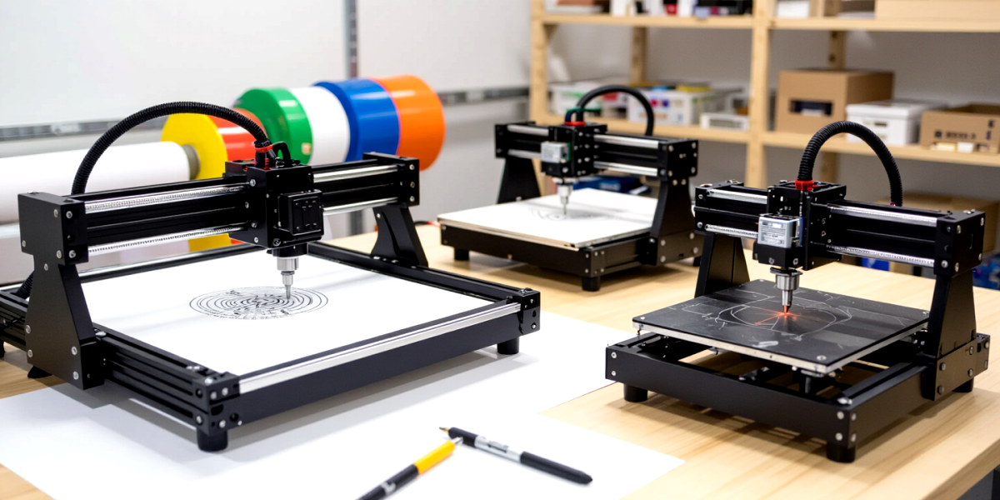

## Introduction

Walk into any makerspace, and you will encounter an impressive array of digital fabrication machines. A pen plotter gracefully draws intricate designs on paper. A vinyl cutter precisely carves adhesive graphics. A 3D printer builds objects layer by layer. A laser engraver etches detailed patterns into wood. A CNC mill carves complex shapes from solid metal. At first glance, these machines appear vastly different in purpose, capability, and output.

Yet beneath their specialized exteriors lies a remarkable commonality: they all share the same foundational principles of motion control. Whether moving a pen, a cutting blade, a print head, a laser, or a spinning mill bit, each machine operates by precisely coordinating movement across multiple axes and controlling when and how a tool interacts with material.

Understanding these shared fundamentals provides a powerful lens for learning digital fabrication. Once you grasp how motion systems work, you can transfer that knowledge across different machines and technologies. This article explores those core concepts, using the Logo programming language to illustrate motion principles in an accessible way, then introducing G-code—the language that actually controls most digital fabrication equipment.



## The Universal Language of Motion

### What Makes These Machines Similar?

Despite their differences, all digital fabrication machines solve the same basic challenge: moving a tool (or material) to precise positions in space and controlling what that tool does at each position. This challenge breaks down into two fundamental components:

1. **Positioning System**: Moving along defined axes (X, Y, Z, and sometimes more)
2. **Tool Control**: Activating, deactivating, or modulating the tool's effect on the material

A pen plotter moves a pen across paper (X and Y axes) and lifts or lowers it (Z axis or pen up/down). A 3D printer moves a print head in three dimensions while controlling filament extrusion. A CNC mill moves a spinning bit through space while controlling cutting depth and speed. The specifics differ, but the underlying motion control concepts remain consistent.

### Axes of Movement

Most digital fabrication machines use a Cartesian coordinate system with perpendicular axes:

- **X-axis**: Typically left-right movement (horizontal)
- **Y-axis**: Typically front-back movement (horizontal)  
- **Z-axis**: Typically up-down movement (vertical)

Some machines add rotational axes:

- **A-axis**: Rotation around the X-axis
- **B-axis**: Rotation around the Y-axis
- **C-axis**: Rotation around the Z-axis

The number and configuration of axes determine what the machine can do. A pen plotter might only need X and Y movement with simple pen up/down control. A 3-axis CNC mill adds Z-axis depth. A 5-axis CNC mill adds rotational capability for complex angles.

### Absolute vs. Relative Positioning

Motion systems use two fundamental ways to specify positions:

**Absolute positioning** defines locations relative to a fixed origin point (0,0,0). When you command the machine to move to position (10, 20), it goes to that exact coordinate in the workspace, regardless of where it currently sits.

**Relative positioning** defines movements as distances from the current location. A command to move 5 units in X and 3 units in Y means "from wherever you are now, go 5 units right and 3 units forward."

Both approaches have value. Absolute positioning provides consistency and repeatability. Relative positioning offers flexibility and easier mental modeling of movement sequences.

## Learning Motion with Logo

Before diving into the technical complexity of G-code, let's explore motion concepts through Logo—a programming language originally designed to teach children about programming and computational thinking. Logo's simplicity makes it perfect for understanding how motion commands work.

### What is Logo?

Logo was created in 1967 by Wally Feurzeig, Seymour Papert, and Cynthia Solomon at Bolt, Beranek and Newman (BBN). The language is best known for "turtle graphics," where you control a virtual turtle that moves around the screen, drawing as it goes. The turtle has a position, heading (direction), and a pen that can be up or down.

This turtle metaphor maps remarkably well to digital fabrication concepts. The turtle's position corresponds to tool position. Its heading matches tool direction. The pen state (up/down) parallels tool activation (on/off, engaged/disengaged).

### Basic Logo Commands

Logo uses simple, intuitive commands to control the turtle:

**Movement Commands:**
- `FORWARD n` (or `FD n`): Move forward n units
- `BACK n` (or `BK n`): Move backward n units  
- `RIGHT n` (or `RT n`): Turn right n degrees
- `LEFT n` (or `LT n`): Turn left n degrees

**Pen Commands:**
- `PENUP` (or `PU`): Lift pen (stop drawing)
- `PENDOWN` (or `PD`): Lower pen (start drawing)

**Position Commands:**
- `SETXY x y`: Move to absolute position (x, y)
- `SETX x`: Set X position
- `SETY y`: Set Y position
- `HOME`: Return to origin (0, 0) facing up

### Drawing a Square

Let's see how these commands work together to draw a simple square:

```logo
PENDOWN
FORWARD 100
RIGHT 90
FORWARD 100
RIGHT 90
FORWARD 100
RIGHT 90
FORWARD 100
RIGHT 90
PENUP
```

This sequence moves forward, turns right 90 degrees, and repeats four times, creating a square. The turtle ends where it started, having traced a complete circuit.

### Understanding Relative Movement

Notice that Logo commands like `FORWARD` and `RIGHT` are inherently relative. The turtle moves forward from wherever it currently is, in whatever direction it currently faces. This relative approach makes it easy to think about sequences of movements without tracking exact coordinates.

Consider drawing a triangle:

```logo
PENDOWN
FORWARD 100
RIGHT 120
FORWARD 100
RIGHT 120
FORWARD 100
RIGHT 120
PENUP
```

The turtle turns 120 degrees at each corner (since a triangle's exterior angles sum to 360 degrees and 360÷3=120). The movements build on each other sequentially.

### Combining Absolute and Relative Positioning

Logo also supports absolute positioning with commands like `SETXY`. This proves useful when you need to jump to specific locations:

```logo
PENUP
SETXY 0 0        ; Start at origin
PENDOWN
SETXY 100 0      ; Draw line to (100, 0)
SETXY 100 100    ; Draw line to (100, 100)
SETXY 0 100      ; Draw line to (0, 100)
SETXY 0 0        ; Complete square back to origin
PENUP
```

This draws the same square using absolute coordinates instead of relative movements and turns.

### Creating Reusable Patterns with Procedures

Logo's power emerges when you define reusable procedures. Here's a procedure to draw a square of any size:

```logo
TO SQUARE :size
  REPEAT 4 [
    FORWARD :size
    RIGHT 90
  ]
END
```

Now `SQUARE 50` draws a 50-unit square, while `SQUARE 150` draws a 150-unit square. You can build more complex designs by combining procedures:

```logo
TO SQUARE :size
  REPEAT 4 [
    FORWARD :size
    RIGHT 90
  ]
END

TO SQUARES
  SQUARE 50
  PENUP
  FORWARD 75
  PENDOWN
  SQUARE 75
  PENUP
  FORWARD 100
  PENDOWN
  SQUARE 100
END
```

This `SQUARES` procedure draws three squares of increasing size, separated by gaps.

### Mapping Logo to Physical Machines

The Logo turtle graphics model translates directly to physical fabrication:

- **Pen plotter**: The turtle IS the pen. `PENDOWN` lowers the pen to paper. `FORWARD` moves the pen carriage.
- **Vinyl cutter**: The turtle represents the cutting blade. `PENDOWN` means blade engaged (cutting). `FORWARD` moves the blade head.
- **Laser engraver**: The turtle is the laser head position. `PENDOWN` means laser on. `FORWARD` moves the laser assembly.
- **CNC mill**: The turtle represents the cutting bit position. `PENDOWN` might mean engaging depth. `FORWARD` moves the mill head.

This conceptual mapping reveals why Logo serves as such an effective teaching tool for motion control. The commands mirror real machine operations while remaining easy to understand and experiment with.

### Limitations of the Logo Model

Logo's 2D turtle graphics model simplifies the real complexity of digital fabrication. Real machines add:

- **Z-axis control**: Height, depth, or layer positioning
- **Speed control**: How fast movements occur
- **Tool parameters**: Spindle speed, laser power, extrusion rate, etc.
- **Acceleration**: How quickly the machine speeds up or slows down
- **Precision**: Sub-millimeter positioning accuracy
- **Coordinate systems**: Multiple reference frames and work offsets

Logo provides the conceptual foundation, but real machines require more sophisticated control languages. That's where G-code enters the picture.

## Introduction to G-code

### What is G-code?

G-code (Geometric Code) is the standardized numerical control programming language used to control CNC machines, 3D printers, laser engravers, and other automated manufacturing equipment. Developed in the 1950s at MIT, G-code has become the de facto standard for machine control across the industry.

While G-code might look cryptic at first glance, it operates on the same motion principles we explored with Logo. Each line of G-code tells the machine what to do: where to move, how fast to go, and what to do with the tool.

### G-code Structure

A typical G-code program consists of numbered lines (called blocks), each containing one or more commands:

```gcode
G0 X10 Y10 Z5
G1 X20 Y20 F1000
M3 S12000
G1 X30 Y30
M5
```

Each line starts with a letter followed by numbers:

- **G-commands**: Motion and positioning commands (G0, G1, G2, G3, etc.)
- **M-commands**: Machine functions like spindle or laser control (M3, M5, etc.)
- **Coordinates**: X, Y, Z positions
- **Parameters**: F (feedrate/speed), S (spindle/laser power), etc.

### Modal Commands

G-code uses "modal" commands that remain active until changed. For example, once you issue `G1` (linear move), all subsequent coordinate commands will be linear moves until you specify a different movement mode. This reduces repetition:

```gcode
G1 F1000        ; Set linear move mode at 1000 mm/min
X10 Y10         ; Move to (10, 10)
X20 Y20         ; Move to (20, 20)
X30 Y30         ; Move to (30, 30)
```

### Basic Motion Commands

#### G0: Rapid Positioning (Non-cutting Move)

`G0` moves the machine as quickly as possible without concern for material interaction. Use this for positioning moves when the tool is not engaged:

```gcode
G0 X50 Y50 Z10
```

This rapidly moves to position X=50, Y=50, Z=10. On a CNC mill, the bit is typically raised clear of material. On a pen plotter, the pen is up. On a laser engraver, the laser is off.

#### G1: Linear Interpolation (Cutting Move)

`G1` moves the machine at a controlled speed (feedrate), suitable for when the tool is engaged with material:

```gcode
G1 X100 Y50 F500
```

This moves to position X=100, Y=50 at 500 units per minute (typically mm/min). The `F` parameter sets the feedrate for this and subsequent G1 moves.

#### G2 and G3: Circular Interpolation

`G2` (clockwise arc) and `G3` (counterclockwise arc) create curved paths:

```gcode
G2 X20 Y20 I10 J0 F500
```

This creates a clockwise arc ending at X=20, Y=20, with the arc center offset 10 units in X (I=10) and 0 units in Y (J=0) from the starting position.

#### G28: Home

`G28` sends the machine to its home position (typically 0,0,0 or machine-defined reference):

```gcode
G28 X Y Z
```

This homes all three axes. You can home specific axes individually: `G28 X` homes just the X-axis.

### Coordinate Systems and Modes

#### G90: Absolute Positioning

In absolute mode (G90), all coordinates are interpreted relative to the work coordinate system origin:

```gcode
G90             ; Set absolute positioning
G0 X10 Y10      ; Move to position (10, 10)
G0 X20 Y20      ; Move to position (20, 20)
```

Each coordinate specifies an exact position, not a relative offset.

#### G91: Relative Positioning (Incremental)

In relative mode (G91), coordinates specify movement distances from the current position:

```gcode
G91             ; Set relative positioning
G0 X10 Y10      ; Move 10 units in X and 10 units in Y from current position
G0 X10 Y10      ; Move another 10 units in X and 10 in Y
```

If you started at (0,0), the first move takes you to (10,10), and the second to (20,20). The same coordinates produce different results based on current position.

### Tool Control Commands

#### M3/M4: Spindle or Laser On

`M3` (clockwise) or `M4` (counterclockwise) activates the spindle motor on a CNC mill or turns on a laser:

```gcode
M3 S12000       ; Start spindle at 12,000 RPM
```

```gcode
M4 S80          ; Start laser at 80% power
```

The `S` parameter specifies speed (for spindles) or power (for lasers).

#### M5: Spindle or Laser Off

`M5` deactivates the spindle or laser:

```gcode
M5
```

#### M0: Program Stop

`M0` pauses program execution, waiting for operator intervention:

```gcode
M0              ; Pause for inspection or tool change
```

### Speed Control

#### F Parameter: Feedrate

The `F` parameter specifies movement speed, typically in millimeters per minute (mm/min) or inches per minute (in/min):

```gcode
G1 X50 Y50 F1000    ; Move at 1000 mm/min
```

Different materials and operations require different feedrates. Faster speeds increase productivity but may reduce quality or cause tool damage. Slower speeds improve precision and surface finish.

### Practical G-code Example: Drawing a Square

Let's translate our Logo square into G-code for a pen plotter:

```gcode
G90                 ; Absolute positioning mode
G0 Z5               ; Raise pen (Z=5 is pen-up position)
G0 X0 Y0            ; Move to starting corner
G1 Z0 F500          ; Lower pen (Z=0 is pen-down position)
G1 X100 Y0          ; Draw line to (100, 0)
G1 X100 Y100        ; Draw line to (100, 100)
G1 X0 Y100          ; Draw line to (0, 100)
G1 X0 Y0            ; Draw line back to (0, 0)
G0 Z5               ; Raise pen
M2                  ; End program
```

This accomplishes the same task as our Logo square, using absolute positioning and explicit Z-axis control for pen up/down.

### Practical G-code Example: CNC Milling a Pocket

Here's a simplified example of milling a rectangular pocket:

```gcode
G90                 ; Absolute positioning
G0 Z5               ; Rapid move to safe height
G0 X10 Y10          ; Rapid to start position
M3 S12000           ; Start spindle at 12,000 RPM
G1 Z-2 F200         ; Plunge to 2mm depth at 200 mm/min
G1 X40 F800         ; Cut to X=40 at 800 mm/min
G1 Y40              ; Cut to Y=40
G1 X10              ; Cut to X=10
G1 Y10              ; Cut back to Y=10 (completing rectangle)
G0 Z5               ; Retract to safe height
M5                  ; Stop spindle
M2                  ; End program
```

This program creates a rectangular pocket 30mm × 30mm, 2mm deep, starting at position (10,10).

### Comments in G-code

Comments help document what G-code does. Use parentheses for inline comments:

```gcode
G0 X0 Y0 (move to origin)
```

Or semicolons for end-of-line comments:

```gcode
G0 X0 Y0 ; move to origin
```

Well-commented G-code makes programs easier to understand, debug, and modify.

### G-code Dialects and Variations

While G-code has standards (RS-274D, ISO 6983), individual machine manufacturers implement variations. A command supported on one machine might differ or not exist on another. Common variations include:

- **Coordinate interpretation**: Units (mm vs. inches), axis directions
- **M-codes**: Machine-specific functions vary significantly
- **Parameters**: Different machines may use different letters or formats
- **Extensions**: Custom G-codes for special features

Always consult your specific machine's documentation for supported commands and parameters. What works on a GRBL-based CNC mill may differ from an industrial Fanuc controller or a Marlin-based 3D printer.

## Bridging Concepts to Real Machines

### From Logo to G-code: A Comparison

The Logo turtle and G-code share conceptual DNA but serve different purposes:

| Concept | Logo | G-code |
|---------|------|--------|
| Forward movement | `FORWARD 100` | `G1 X100` (or relative) |
| Positioning | `SETXY 50 50` | `G0 X50 Y50` |
| Tool control | `PENUP` / `PENDOWN` | `G0 Z5` / `G1 Z0` or `M3` / `M5` |
| Relative positioning | Default behavior | `G91` mode |
| Absolute positioning | `SETXY` commands | `G90` mode (default) |
| Speed control | Not standard | `F` parameter |
| Procedures/Functions | Built-in language feature | Typically handled by CAM software |

Logo emphasizes learning and exploration. G-code emphasizes precision, efficiency, and real-world machine control.

### The Role of CAM Software

Most users don't hand-write G-code for complex parts. Computer-Aided Manufacturing (CAM) software generates G-code from 3D models or 2D designs:

1. **Create design**: Model part in CAD software (Fusion 360, SolidWorks, etc.)
2. **Define operations**: Specify toolpaths, feeds, speeds in CAM software
3. **Generate G-code**: CAM exports optimized G-code for your machine
4. **Post-process**: CAM applies machine-specific adaptations
5. **Simulate**: Verify toolpaths won't crash or damage anything
6. **Execute**: Send G-code to machine controller

CAM software handles the tedious work of calculating exact coordinates, optimizing tool movements, and generating thousands of lines of code. However, understanding G-code fundamentals helps you troubleshoot issues, make small adjustments, and understand what your machine is actually doing.

### Machine Controllers and Firmware

The G-code you write or generate doesn't directly control motors. It passes through machine controller firmware that interprets commands and generates precise electrical signals to stepper or servo motors:

**Common controller firmware includes:**

- **GRBL**: Popular open-source CNC controller for Arduino
- **Marlin**: Widely used 3D printer firmware
- **LinuxCNC**: Powerful open-source CNC control software
- **Smoothieware**: Feature-rich firmware for various machines
- **Commercial controllers**: Mach3, Fanuc, Haas, etc.

Each firmware interprets G-code slightly differently and adds its own features, parameters, and limitations. Understanding your controller's specific implementation helps you write effective G-code.

## Practical Applications Across Machine Types

### Pen Plotters

Pen plotters translate the Logo turtle model most literally into hardware. The pen holder moves in X and Y, while a servo or solenoid raises and lowers the pen (Z-axis, or sometimes just called pen up/down).

**Key considerations:**
- Fast rapid moves between drawn segments
- Smooth acceleration to avoid pen skipping
- Precise pen pressure control (Z-axis depth)
- Coordinated XY movement for smooth curves

### Vinyl Cutters

Vinyl cutters share similarities with pen plotters but cut instead of draw. The blade depth, angle, and pressure become critical parameters.

**Key considerations:**
- Blade depth adjustment for material thickness
- Cutting speed appropriate for material
- Corner handling (blade drag compensation)
- Weeding complexity vs. cutting quality tradeoffs

### 3D Printers

3D printers add complexity by building in layers, requiring tight coordination between XYZ motion and plastic extrusion (often considered a fourth axis, E).

**Key considerations:**
- Layer height and resolution
- Print speed vs. quality tradeoffs
- Retraction to prevent stringing
- Temperature management during moves
- Support structure generation and removal

### Laser Engravers

Laser engravers use XY motion while modulating laser power. Unlike pens or blades, lasers don't touch the material, enabling very fast speeds with precise power control.

**Key considerations:**
- Power levels for different materials
- Speed vs. depth of engraving relationships
- Multiple passes for deeper cuts
- Raster vs. vector engraving strategies
- Safety interlocks and enclosure requirements

### CNC Mills

CNC mills represent the most complex application, with full 3-axis (or more) control, heavy cutting forces, and critical precision requirements.

**Key considerations:**
- Tool selection for materials and operations
- Speeds and feeds optimization
- Chip evacuation and cooling
- Workholding and fixturing
- Tool change sequences (if multi-tool)
- Safety zones and crash avoidance



## The Learning Path Forward

Understanding motion control fundamentals gives you a powerful foundation for exploring any digital fabrication technology. Here's how to continue building your knowledge:

### Practice with Simulation

Before running code on real machines, practice with simulators:

- **Logo interpreters**: Many free online Logo environments let you experiment with turtle graphics
- **G-code simulators**: CAMotics, NCViewer, and others visualize toolpaths without requiring hardware
- **CAM software trials**: Many CAM packages offer free trials or hobby licenses

### Start Simple

Begin with simple 2D projects:
- Draw basic shapes on a pen plotter
- Cut simple vinyl decals
- Engrave text or 2D designs with a laser

Master fundamental concepts before advancing to complex 3D machining.

### Learn Your Machine's Dialect

Read your machine's documentation thoroughly. Understand:
- Supported G-codes and M-codes
- Coordinate system setup
- Homing and limit switch behavior
- Safety features and emergency stops
- Recommended feeds and speeds for common materials

### Study Existing G-code

Open G-code files generated by CAM software and study what they do. Look for patterns:
- How does the code initialize the machine?
- What safety moves happen before cutting?
- How are curves generated?
- Where do tool changes occur?
- How does the program end safely?

### Join Communities

Connect with other makers and fabricators:
- Online forums for your specific machine
- Makerspaces and hackerspaces in your area
- Social media groups focused on digital fabrication
- YouTube channels with tutorials and project examples

### Experiment Safely

Digital fabrication involves real hazards: spinning tools, powerful lasers, hot extruders, moving parts. Always:
- Understand your machine's safety features
- Wear appropriate personal protective equipment
- Start with safe materials and conservative settings
- Keep emergency stops accessible
- Never leave machines unattended during operation

## Conclusion

Digital fabrication machines might vary in their materials, outputs, and applications, but they all share fundamental motion control principles. Whether you're moving a pen across paper, a cutting blade through vinyl, a laser beam across wood, or a mill bit through metal, you're working with the same core concepts: positioning systems, coordinate systems, tool control, and movement commands.

Logo programming provides an accessible entry point for understanding these concepts. Its intuitive turtle graphics model directly parallels real machine operation while remaining simple enough for experimentation and learning. Once you understand relative and absolute positioning, tool control, and movement sequences in Logo, those concepts transfer directly to more complex systems.

G-code represents the real-world implementation of motion control for digital fabrication. While more technical than Logo, G-code operates on the same principles: commands that tell machines where to move, how fast to go, and what to do with tools. Learning basic G-code commands (G0, G1, G90, G91, M3, M5) gives you insight into what happens beneath the surface when you click "Print" or "Run" in your CAM software.

As you explore different machines and technologies, remember that the motion control fundamentals remain constant. Master these core concepts, and you'll find it much easier to learn new machines, troubleshoot problems, and push the boundaries of what you can create.

The journey from understanding basic turtle graphics to confidently operating complex CNC machines takes time and practice, but the underlying principles stay the same. Each new machine and project builds on that foundation, expanding your capabilities and deepening your understanding of how digital fabrication works.

What will you create with this knowledge? The toolpath is yours to define.

## Materials/Tools Used

**Concepts and Languages:**
- Logo programming language and turtle graphics
- G-code (RS-274D / ISO 6983)
- Cartesian coordinate systems
- Motion control principles

**Example Machines:**
- Pen plotters
- Vinyl cutters
- 3D printers
- Laser engravers
- CNC mills (3-axis and 5-axis)

**Software Tools:**
- Logo interpreters (various online implementations)
- G-code simulators (CAMotics, NCViewer)
- CAM software (Fusion 360, Carbide Create, others)
- Machine controller firmware (GRBL, Marlin, LinuxCNC)

## Further Reading

- [Logo Foundation](https://el.media.mit.edu/logo-foundation/) - History and resources for Logo programming
- [NIST RS274NGC G-code Specification](https://www.nist.gov/publications/nist-rs274ngc-interpreter-version-3) - Official G-code standard documentation
- [LinuxCNC G-code Reference](http://linuxcnc.org/docs/html/gcode.html) - Comprehensive G-code command reference
- *"CNC Programming Handbook"* by Peter Smid - Detailed guide to G-code and CNC operations
- [GRBL GitHub Repository](https://github.com/grbl/grbl) - Open-source CNC controller firmware

---

*Have questions about motion control, Logo programming, or G-code? Join the discussion in the comments below or connect with the Toolpath Studio community on Discord!*
